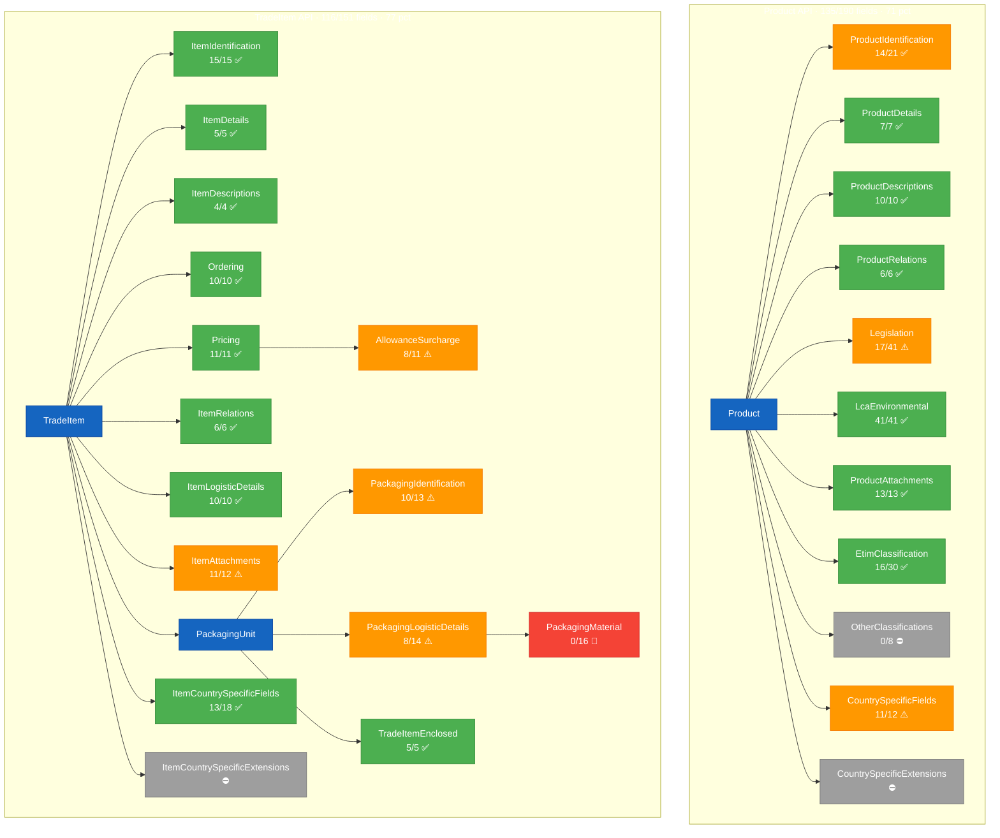

# ETIM xChange → OpenAPI Field Mapping Registry

**ETIM Schema Version**: V2.0 (2025-11-27)  
**Last Updated**: 2025-04-19  
**Purpose**: Tracks every ETIM xChange field's mapping status in the Product API and TradeItem API

## Status Legend

| Status | Meaning |
|--------|---------|
| ✅ Mapped | Field is implemented in the OpenAPI API |
| ⚠️ Partial | Field structure exists but some sub-fields are missing or flattened differently |
| 🔲 Todo | Field should be mapped but isn't yet |
| ⛔ Excluded | Intentionally not mapped (with rationale) |

---

## Coverage Overview

> **Legend**: 🟢 Green = all in-scope fields mapped · 🟡 Orange = some fields partial or todo · 🔴 Red = not yet mapped · ⚪ Gray = intentionally excluded. Fractions show mapped+partial / total ETIM fields per branch.

---

## Product API Mappings

### ProductIdentification

| ETIM Field | ETIM Path | Status | OpenAPI Schema | OpenAPI Property | Notes |
|---|---|---|---|---|---|
| ManufacturerIdGln | Product[].ProductIdentification.ManufacturerIdGln | ✅ Mapped | Product.yaml | manufacturerIdGln | Path parameter + response field; composite key part |
| ManufacturerIdDuns | Product[].ProductIdentification.ManufacturerIdDuns | ⛔ Excluded | — | — | Belongs in Manufacturer service |
| ManufacturerName | Product[].ProductIdentification.ManufacturerName | ⛔ Excluded | — | — | Belongs in Manufacturer service |
| ManufacturerShortname | Product[].ProductIdentification.ManufacturerShortname | ⛔ Excluded | — | — | Belongs in Manufacturer service |
| ManufacturerProductNumber | Product[].ProductIdentification.ManufacturerProductNumber | ✅ Mapped | Product.yaml | manufacturerProductNumber | Path parameter + response field; composite key part |
| ProductGtin[] | Product[].ProductIdentification.ProductGtin[] | ✅ Mapped | Product.yaml | productGtins | Array of GTIN strings |
| UnbrandedProduct | Product[].ProductIdentification.UnbrandedProduct | ✅ Mapped | Product.yaml | unbrandedProduct | Boolean, nullable |
| BrandName | Product[].ProductIdentification.BrandName | ✅ Mapped | Product.yaml | brandName | String, nullable |
| BrandDetails[] | Product[].ProductIdentification.BrandDetails[] | 🔲 Todo | — | — | Multilingual BrandSeries + BrandSeriesVariation |
| BrandDetails[].BrandSeries[] | ...BrandDetails[].BrandSeries[] | 🔲 Todo | — | — | Multilingual array with Language + BrandSeries |
| BrandDetails[].BrandSeries[].Language | ...BrandSeries[].Language | 🔲 Todo | — | — | Language code for brand series |
| BrandDetails[].BrandSeries[].BrandSeries | ...BrandSeries[].BrandSeries | 🔲 Todo | — | — | Brand series name string |
| BrandDetails[].BrandSeriesVariation[] | ...BrandDetails[].BrandSeriesVariation[] | 🔲 Todo | — | — | Multilingual array with Language + BrandSeriesVariation |
| BrandDetails[].BrandSeriesVariation[].Language | ...BrandSeriesVariation[].Language | 🔲 Todo | — | — | Language code for brand series variation |
| BrandDetails[].BrandSeriesVariation[].BrandSeriesVariation | ...BrandSeriesVariation[].BrandSeriesVariation | 🔲 Todo | — | — | Brand series variation name string |
| ProductAnnouncementDate | Product[].ProductIdentification.ProductAnnouncementDate | ✅ Mapped | Product.yaml | productAnnouncementDate | format: date, nullable |
| ProductValidityDate | Product[].ProductIdentification.ProductValidityDate | ✅ Mapped | Product.yaml | productValidityDate | format: date; defaults to CatalogueValidityStart |
| ProductObsolescenceDate | Product[].ProductIdentification.ProductObsolescenceDate | ✅ Mapped | Product.yaml | productObsolescenceDate | format: date, nullable |
| CustomsCommodityCode | Product[].ProductIdentification.CustomsCommodityCode | ✅ Mapped | Product.yaml | customsCommodityCode | HS code string, nullable |
| FactorCustomsCommodityCode | Product[].ProductIdentification.FactorCustomsCommodityCode | ✅ Mapped | Product.yaml | factorCustomsCommodityCode | Converted from ETIM string to number; format: decimal |
| CountryOfOrigin[] | Product[].ProductIdentification.CountryOfOrigin[] | ✅ Mapped | Product.yaml | countryOfOrigin | Array of ISO 3166-1 alpha-2 codes |

### ProductDetails

| ETIM Field | ETIM Path | Status | OpenAPI Schema | OpenAPI Property | Notes |
|---|---|---|---|---|---|
| ProductStatus | Product[].ProductDetails.ProductStatus | ✅ Mapped | Product.yaml | productStatus | Enum: PRE-LAUNCH, ACTIVE, ON HOLD, PLANNED WITHDRAWAL, OBSOLETE |
| ProductType | Product[].ProductDetails.ProductType | ✅ Mapped | Product.yaml | productType | Enum: PHYSICAL, CONTRACT, LICENCE, SERVICE |
| CustomisableProduct | Product[].ProductDetails.CustomisableProduct | ✅ Mapped | Product.yaml | customisableProduct | Boolean, nullable |
| HasSerialNumber | Product[].ProductDetails.HasSerialNumber | ✅ Mapped | Product.yaml | hasSerialNumber | Boolean, nullable |
| WarrantyConsumer | Product[].ProductDetails.WarrantyConsumer | ✅ Mapped | Product.yaml | warrantyConsumer | Integer months, nullable |
| WarrantyBusiness | Product[].ProductDetails.WarrantyBusiness | ✅ Mapped | Product.yaml | warrantyBusiness | Integer months, nullable |
| RelatedManufacturerProductGroup[] | Product[].ProductDetails.RelatedManufacturerProductGroup[] | ✅ Mapped | Product.yaml | relatedManufacturerProductGroup | Array of strings, nullable |

### ProductDetails → ProductDescriptions

| ETIM Field | ETIM Path | Status | OpenAPI Schema | OpenAPI Property | Notes |
|---|---|---|---|---|---|
| ProductDescriptions[] | Product[].ProductDetails.ProductDescriptions[] | ✅ Mapped | Product.yaml | productDescriptions | Array of ProductDescription; dedicated `/descriptions` subresource |
| DescriptionLanguage | ...ProductDescriptions[].DescriptionLanguage | ✅ Mapped | ProductDescription.yaml | descriptionLanguage | Language code (e.g., "en-GB") |
| MinimalProductDescription | ...ProductDescriptions[].MinimalProductDescription | ✅ Mapped | ProductDescription.yaml | minimalProductDescription | Required; max 80 chars |
| UniqueMainProductDescription | ...ProductDescriptions[].UniqueMainProductDescription | ✅ Mapped | ProductDescription.yaml | uniqueMainProductDescription | Max 255 chars, nullable |
| FullProductDescription | ...ProductDescriptions[].FullProductDescription | ✅ Mapped | ProductDescription.yaml | fullProductDescription | Max 10000 chars, nullable |
| ProductMarketingText | ...ProductDescriptions[].ProductMarketingText | ✅ Mapped | ProductDescription.yaml | productMarketingText | Max 10000 chars, nullable |
| ProductSpecificationText | ...ProductDescriptions[].ProductSpecificationText | ✅ Mapped | ProductDescription.yaml | productSpecificationText | Max 10000 chars, nullable |
| ProductApplicationInstructions | ...ProductDescriptions[].ProductApplicationInstructions | ✅ Mapped | ProductDescription.yaml | productApplicationInstructions | Max 10000 chars, nullable |
| ProductKeyword[] | ...ProductDescriptions[].ProductKeyword[] | ✅ Mapped | ProductDescription.yaml | productKeyword | Array of strings, nullable |
| ProductPageUrl | ...ProductDescriptions[].ProductPageUrl | ✅ Mapped | ProductDescription.yaml | productPageUrl | format: uri, nullable |

### ProductRelations

| ETIM Field | ETIM Path | Status | OpenAPI Schema | OpenAPI Property | Notes |
|---|---|---|---|---|---|
| ProductRelations[] | Product[].ProductRelations[] | ✅ Mapped | Product.yaml | productRelations | Array of ProductRelation, nullable |
| RelationType | ...ProductRelations[].RelationType | ✅ Mapped | ProductRelation.yaml | relationType | Enum: ACCESSORY, CONSISTS_OF, CONSUMABLES, etc. |
| RelatedProducts[] | ...ProductRelations[].RelatedProducts[] | ✅ Mapped | ProductRelation.yaml | relatedProducts | Array of RelatedProduct |
| RelatedManufacturerProductNumber | ...RelatedProducts[].RelatedManufacturerProductNumber | ✅ Mapped | RelatedProduct.yaml | relatedManufacturerProductNumber | Required; MPN of related product |
| RelatedProductGtin[] | ...RelatedProducts[].RelatedProductGtin[] | ✅ Mapped | RelatedProduct.yaml | relatedProductGtin | Array of GTINs, nullable |
| RelatedProductQuantity | ...RelatedProducts[].RelatedProductQuantity | ✅ Mapped | RelatedProduct.yaml | relatedProductQuantity | Integer ≥ 1, nullable |

### Legislation

| ETIM Field | ETIM Path | Status | OpenAPI Schema | OpenAPI Property | Notes |
|---|---|---|---|---|---|
| Legislation | Product[].Legislation | ✅ Mapped | Product.yaml | legislation | Nullable object ref to Legislation.yaml |
| ElectricComponentContained | ...Legislation.ElectricComponentContained | ✅ Mapped | Legislation.yaml | electricComponentContained | Boolean, nullable |
| BatteryContained | ...Legislation.BatteryContained | ✅ Mapped | Legislation.yaml | batteryContained | Boolean, nullable |
| WeeeCategory | ...Legislation.WeeeCategory | ✅ Mapped | Legislation.yaml | weeeCategory | Enum: 1–6 |
| RohsIndicator | ...Legislation.RohsIndicator | ✅ Mapped | Legislation.yaml | rohsIndicator | Enum: true, false, exempt; nullable |
| RohsExemptionNumber | ...Legislation.RohsExemptionNumber | ✅ Mapped | Legislation.yaml | rohsExemptionNumber | String, nullable |
| CeMarking | ...Legislation.CeMarking | ✅ Mapped | Legislation.yaml | ceMarking | Boolean, nullable |
| SdsIndicator | ...Legislation.SdsIndicator | ✅ Mapped | Legislation.yaml | sdsIndicator | Boolean, nullable |
| ReachIndicator | ...Legislation.ReachIndicator | ✅ Mapped | Legislation.yaml | reachIndicator | Enum: true, false, no data; nullable |
| ReachDate | ...Legislation.ReachDate | ✅ Mapped | Legislation.yaml | reachDate | format: date, nullable |
| SvhcIdentification[] | ...Legislation.SvhcIdentification[] | 🔲 Todo | — | — | Array of SVHC substance identifiers |
| SvhcIdentification[].CasNumber | ...SvhcIdentification[].CasNumber | 🔲 Todo | — | — | CAS registry number pattern |
| SvhcIdentification[].EcNumber | ...SvhcIdentification[].EcNumber | 🔲 Todo | — | — | EC number pattern |
| ScipNumber | ...Legislation.ScipNumber | ✅ Mapped | Legislation.yaml | scipNumber | UUID string (36 chars), nullable |
| UfiCode | ...Legislation.UfiCode | ✅ Mapped | Legislation.yaml | ufiCode | Pattern: XXXX-XXXX-XXXX-XXXX, nullable |
| UnNumber | ...Legislation.UnNumber | ✅ Mapped | Legislation.yaml | unNumber | 4-digit UN code, nullable |
| HazardClass[] | ...Legislation.HazardClass[] | ✅ Mapped | Legislation.yaml | hazardClass | Array of UN hazard classes, nullable |
| AdrCategory | ...Legislation.AdrCategory | ✅ Mapped | Legislation.yaml | adrCategory | Enum: 0–4, nullable |
| NetWeightHazardousSubstances | ...Legislation.NetWeightHazardousSubstances | ✅ Mapped | Legislation.yaml | netWeightHazardousSubstances | Converted to number; format: decimal |
| VolumeHazardousSubstances | ...Legislation.VolumeHazardousSubstances | ✅ Mapped | Legislation.yaml | volumeHazardousSubstances | Converted to number; format: decimal |
| UnShippingName[] | ...Legislation.UnShippingName[] | 🔲 Todo | — | — | Multilingual UN shipping name |
| UnShippingName[].Language | ...UnShippingName[].Language | 🔲 Todo | — | — | Language code |
| UnShippingName[].UnShippingName | ...UnShippingName[].UnShippingName | 🔲 Todo | — | — | UN proper shipping name string |
| PackingGroup | ...Legislation.PackingGroup | 🔲 Todo | — | — | Enum: I, II, III |
| LimitedQuantities | ...Legislation.LimitedQuantities | 🔲 Todo | — | — | Boolean |
| ExceptedQuantities | ...Legislation.ExceptedQuantities | 🔲 Todo | — | — | Boolean |
| AggregationState | ...Legislation.AggregationState | 🔲 Todo | — | — | Enum: L (Liquid), S (Solid), G (Gas) |
| SpecialProvisionId[] | ...Legislation.SpecialProvisionId[] | 🔲 Todo | — | — | Array of SP codes (e.g., SP123) |
| ClassificationCode | ...Legislation.ClassificationCode | 🔲 Todo | — | — | ADR classification code, max 5 chars |
| HazardLabel[] | ...Legislation.HazardLabel[] | 🔲 Todo | — | — | Array of hazard label numbers |
| EnvironmentalHazards | ...Legislation.EnvironmentalHazards | 🔲 Todo | — | — | Boolean |
| TunnelCode | ...Legislation.TunnelCode | 🔲 Todo | — | — | ADR tunnel restriction code enum |
| LabelCode[] | ...Legislation.LabelCode[] | 🔲 Todo | — | — | GHS pictogram codes (GHS01–GHS09) |
| SignalWord | ...Legislation.SignalWord | 🔲 Todo | — | — | Enum: D (Danger), W (Warning) |
| HazardStatement[] | ...Legislation.HazardStatement[] | 🔲 Todo | — | — | Array of H-statement codes |
| PrecautionaryStatement[] | ...Legislation.PrecautionaryStatement[] | 🔲 Todo | — | — | Array of P-statement codes |
| LiIonTested | ...Legislation.LiIonTested | 🔲 Todo | — | — | Boolean — lithium-ion UN 38.3 tested |
| LithiumAmount | ...Legislation.LithiumAmount | 🔲 Todo | — | — | Lithium content in grams (decimal string) |
| BatteryEnergy | ...Legislation.BatteryEnergy | 🔲 Todo | — | — | Battery energy in Wh (decimal string) |
| Nos274 | ...Legislation.Nos274 | 🔲 Todo | — | — | Boolean — not otherwise specified (ADR SP274) |
| HazardTrigger[] | ...Legislation.HazardTrigger[] | 🔲 Todo | — | — | Array of hazard trigger descriptions |
| EprelRegistrationNumber | ...Legislation.EprelRegistrationNumber | 🔲 Todo | — | — | EU EPREL energy label registration number |

### LcaEnvironmental

| ETIM Field | ETIM Path | Status | OpenAPI Schema | OpenAPI Property | Notes |
|---|---|---|---|---|---|
| LcaEnvironmental | Product[].LcaEnvironmental | ✅ Mapped | Product.yaml | lcaEnvironmental | Nullable object ref to LcaEnvironmental.yaml |
| EpdValidityStartDate | ...LcaEnvironmental.EpdValidityStartDate | ✅ Mapped | LcaEnvironmental.yaml | epdValidityStartDate | format: date; defaults to CatalogueValidityStart |
| EpdValidityExpiryDate | ...LcaEnvironmental.EpdValidityExpiryDate | ✅ Mapped | LcaEnvironmental.yaml | epdValidityExpiryDate | format: date, nullable |
| ThirdPartyVerification | ...LcaEnvironmental.ThirdPartyVerification | ✅ Mapped | LcaEnvironmental.yaml | thirdPartyVerification | Enum: none, internally, externally |
| EpdOperatorName | ...LcaEnvironmental.EpdOperatorName | ✅ Mapped | LcaEnvironmental.yaml | epdOperatorName | String, nullable |
| EpdOperatorUri | ...LcaEnvironmental.EpdOperatorUri | ✅ Mapped | LcaEnvironmental.yaml | epdOperatorUri | format: uri, nullable |
| OperatorEpdId | ...LcaEnvironmental.OperatorEpdId | ✅ Mapped | LcaEnvironmental.yaml | operatorEpdId | String, nullable |
| ManufacturerEpdId | ...LcaEnvironmental.ManufacturerEpdId | ✅ Mapped | LcaEnvironmental.yaml | manufacturerEpdId | String, nullable |
| ProductCategoryRulesDescription | ...LcaEnvironmental.ProductCategoryRulesDescription | ✅ Mapped | LcaEnvironmental.yaml | productCategoryRulesDescription | String, nullable |
| ProductCategoryRulesUri | ...LcaEnvironmental.ProductCategoryRulesUri | ✅ Mapped | LcaEnvironmental.yaml | productCategoryRulesUri | format: uri, nullable |
| ProductSpecificRulesDescription | ...LcaEnvironmental.ProductSpecificRulesDescription | ✅ Mapped | LcaEnvironmental.yaml | productSpecificRulesDescription | String, nullable |
| ProductSpecificRulesUri | ...LcaEnvironmental.ProductSpecificRulesUri | ✅ Mapped | LcaEnvironmental.yaml | productSpecificRulesUri | format: uri, nullable |
| DeclaredUnitUnit | ...LcaEnvironmental.DeclaredUnitUnit | ✅ Mapped | LcaEnvironmental.yaml | declaredUnitUnit | Enum of UN/CEFACT unit codes |
| DeclaredUnitQuantity | ...LcaEnvironmental.DeclaredUnitQuantity | ✅ Mapped | LcaEnvironmental.yaml | declaredUnitQuantity | Converted to number; format: decimal |
| FunctionalUnitDescription[] | ...LcaEnvironmental.FunctionalUnitDescription[] | ✅ Mapped | LcaEnvironmental.yaml | functionalUnitDescription | Multilingual array, nullable |
| FunctionalUnitDescription[].Language | ...FunctionalUnitDescription[].Language | ✅ Mapped | LcaEnvironmental.yaml | functionalUnitDescription[].language | Language code |
| FunctionalUnitDescription[].FunctionalUnitDescription | ...FunctionalUnitDescription[].FunctionalUnitDescription | ✅ Mapped | LcaEnvironmental.yaml | functionalUnitDescription[].functionalUnitDescription | Max 10000 chars |
| LcaReferenceLifetime | ...LcaEnvironmental.LcaReferenceLifetime | ✅ Mapped | LcaEnvironmental.yaml | lcaReferenceLifetime | Integer years |

### LcaEnvironmental → LcaDeclaration

| ETIM Field | ETIM Path | Status | OpenAPI Schema | OpenAPI Property | Notes |
|---|---|---|---|---|---|
| LcaDeclaration[] | ...LcaEnvironmental.LcaDeclaration[] | ✅ Mapped | LcaEnvironmental.yaml | lcaDeclaration | Array of LcaDeclaration |
| LifeCycleStage | ...LcaDeclaration[].LifeCycleStage | ✅ Mapped | LcaDeclaration.yaml | lifeCycleStage | Enum: A1, A2, A3, A1-A3, … D |
| LcaDeclarationIndicator | ...LcaDeclaration[].LcaDeclarationIndicator | ✅ Mapped | LcaDeclaration.yaml | lcaDeclarationIndicator | Enum: MDE, MND, MNR, AGG |
| DeclaredUnitGwpTotal | ...LcaDeclaration[].DeclaredUnitGwpTotal | ✅ Mapped | LcaDeclaration.yaml | declaredUnitGwpTotal | number, nullable; kg CO₂ eq |
| DeclaredUnitGwpFossil | ...LcaDeclaration[].DeclaredUnitGwpFossil | ✅ Mapped | LcaDeclaration.yaml | declaredUnitGwpFossil | number, nullable; kg CO₂ eq |
| DeclaredUnitGwpBiogenic | ...LcaDeclaration[].DeclaredUnitGwpBiogenic | ✅ Mapped | LcaDeclaration.yaml | declaredUnitGwpBiogenic | number, nullable; kg CO₂ eq |
| DeclaredUnitGwpLuluc | ...LcaDeclaration[].DeclaredUnitGwpLuluc | ✅ Mapped | LcaDeclaration.yaml | declaredUnitGwpLuluc | number, nullable; kg CO₂ eq |
| DeclaredUnitAp | ...LcaDeclaration[].DeclaredUnitAp | ✅ Mapped | LcaDeclaration.yaml | declaredUnitAp | number, nullable; kg SO₂ eq |
| DeclaredUnitEpFreshwater | ...LcaDeclaration[].DeclaredUnitEpFreshwater | ✅ Mapped | LcaDeclaration.yaml | declaredUnitEpFreshwater | number, nullable; kg PO₄ eq |
| DeclaredUnitEpMarine | ...LcaDeclaration[].DeclaredUnitEpMarine | ✅ Mapped | LcaDeclaration.yaml | declaredUnitEpMarine | number, nullable; kg N eq |
| DeclaredUnitEpTerrestrial | ...LcaDeclaration[].DeclaredUnitEpTerrestrial | ✅ Mapped | LcaDeclaration.yaml | declaredUnitEpTerrestrial | number, nullable; mol N eq |
| DeclaredUnitPocp | ...LcaDeclaration[].DeclaredUnitPocp | ✅ Mapped | LcaDeclaration.yaml | declaredUnitPocp | number, nullable; kg NMVOC eq |
| DeclaredUnitOdp | ...LcaDeclaration[].DeclaredUnitOdp | ✅ Mapped | LcaDeclaration.yaml | declaredUnitOdp | number, nullable; kg CFC-11 eq |
| DeclaredUnitAdpe | ...LcaDeclaration[].DeclaredUnitAdpe | ✅ Mapped | LcaDeclaration.yaml | declaredUnitAdpe | number, nullable; kg Sb eq |
| DeclaredUnitAdpf | ...LcaDeclaration[].DeclaredUnitAdpf | ✅ Mapped | LcaDeclaration.yaml | declaredUnitAdpf | number, nullable; MJ |
| DeclaredUnitWdp | ...LcaDeclaration[].DeclaredUnitWdp | ✅ Mapped | LcaDeclaration.yaml | declaredUnitWdp | number, nullable; m³ world eq |
| DeclaredUnitPert | ...LcaDeclaration[].DeclaredUnitPert | ✅ Mapped | LcaDeclaration.yaml | declaredUnitPert | number, nullable; MJ |
| DeclaredUnitPenrt | ...LcaDeclaration[].DeclaredUnitPenrt | ✅ Mapped | LcaDeclaration.yaml | declaredUnitPenrt | number, nullable; MJ |
| DeclaredUnitPm | ...LcaDeclaration[].DeclaredUnitPm | ✅ Mapped | LcaDeclaration.yaml | declaredUnitPm | number, nullable; disease incidence |
| DeclaredUnitIrp | ...LcaDeclaration[].DeclaredUnitIrp | ✅ Mapped | LcaDeclaration.yaml | declaredUnitIrp | number, nullable; kBq U235 eq |
| DeclaredUnitEtpfw | ...LcaDeclaration[].DeclaredUnitEtpfw | ✅ Mapped | LcaDeclaration.yaml | declaredUnitEtpfw | number, nullable; CTUe |
| DeclaredUnitHtpc | ...LcaDeclaration[].DeclaredUnitHtpc | ✅ Mapped | LcaDeclaration.yaml | declaredUnitHtpc | number, nullable; CTUh |
| DeclaredUnitHtpnc | ...LcaDeclaration[].DeclaredUnitHtpnc | ✅ Mapped | LcaDeclaration.yaml | declaredUnitHtpnc | number, nullable; CTUh |
| DeclaredUnitSqp | ...LcaDeclaration[].DeclaredUnitSqp | ✅ Mapped | LcaDeclaration.yaml | declaredUnitSqp | number, nullable; dimensionless |

### ProductAttachments

| ETIM Field | ETIM Path | Status | OpenAPI Schema | OpenAPI Property | Notes |
|---|---|---|---|---|---|
| ProductAttachments[] | Product[].ProductAttachments[] | ✅ Mapped | Product.yaml | productAttachments | Array of ProductAttachment, nullable |
| AttachmentType | ...ProductAttachments[].AttachmentType | ✅ Mapped | ProductAttachment.yaml | attachmentType | Enum of ATX codes |
| AttachmentTypeSpecification | ...ProductAttachments[].AttachmentTypeSpecification | ✅ Mapped | ProductAttachment.yaml | attachmentTypeSpecification | Enum of MDX codes, nullable |
| AttachmentOrder | ...ProductAttachments[].AttachmentOrder | ✅ Mapped | ProductAttachment.yaml | attachmentOrder | Integer ≥ 1, nullable |
| AttachmentDetails[] | ...ProductAttachments[].AttachmentDetails[] | ✅ Mapped | ProductAttachment.yaml | attachmentDetails | Array of AttachmentDetails |
| AttachmentLanguage[] | ...AttachmentDetails[].AttachmentLanguage[] | ✅ Mapped | AttachmentDetails.yaml | attachmentLanguage | Array of language codes, nullable |
| AttachmentFilename | ...AttachmentDetails[].AttachmentFilename | ✅ Mapped | AttachmentDetails.yaml | attachmentFilename | String max 100, nullable |
| AttachmentUri | ...AttachmentDetails[].AttachmentUri | ✅ Mapped | AttachmentDetails.yaml | attachmentUri | format: uri; required |
| AttachmentDescription[] | ...AttachmentDetails[].AttachmentDescription[] | ✅ Mapped | AttachmentDetails.yaml | attachmentDescription | Multilingual array, nullable |
| AttachmentDescription[].Language | ...AttachmentDescription[].Language | ✅ Mapped | AttachmentDetails.yaml | attachmentDescription[].language | Language code |
| AttachmentDescription[].AttachmentDescription | ...AttachmentDescription[].AttachmentDescription | ✅ Mapped | AttachmentDetails.yaml | attachmentDescription[].attachmentDescription | String max 255 |
| AttachmentIssueDate | ...AttachmentDetails[].AttachmentIssueDate | ✅ Mapped | AttachmentDetails.yaml | attachmentIssueDate | format: date, nullable |
| AttachmentExpiryDate | ...AttachmentDetails[].AttachmentExpiryDate | ✅ Mapped | AttachmentDetails.yaml | attachmentExpiryDate | format: date, nullable |

### EtimClassification

| ETIM Field | ETIM Path | Status | OpenAPI Schema | OpenAPI Property | Notes |
|---|---|---|---|---|---|
| EtimClassification[] | Product[].EtimClassification[] | ✅ Mapped | Product.yaml | etimClassifications | Array of EtimClassification, nullable |
| EtimReleaseVersion | ...EtimClassification[].EtimReleaseVersion | ✅ Mapped | EtimClassification.yaml | etimReleaseVersion | Pattern: version or "DYNAMIC" |
| EtimClassCode | ...EtimClassification[].EtimClassCode | ✅ Mapped | EtimClassification.yaml | etimClassCode | Pattern: EC + 6 digits |
| EtimClassVersion | ...EtimClassification[].EtimClassVersion | ✅ Mapped | EtimClassification.yaml | etimClassVersion | Integer ≥ 1, nullable |
| EtimDynamicReleaseDate | ...EtimClassification[].EtimDynamicReleaseDate | ✅ Mapped | EtimClassification.yaml | etimDynamicReleaseDate | format: date, nullable |
| EtimFeatures[] | ...EtimClassification[].EtimFeatures[] | ✅ Mapped | EtimClassification.yaml | etimFeatures | Array of EtimFeature, nullable |
| EtimFeatureCode | ...EtimFeatures[].EtimFeatureCode | ✅ Mapped | EtimFeature.yaml | etimFeatureCode | Pattern: EF + 6 digits / variants |
| EtimValueCode | ...EtimFeatures[].EtimValueCode | ✅ Mapped | EtimFeature.yaml | etimValueCode | Pattern: EV + 6 digits, nullable |
| EtimValueNumeric | ...EtimFeatures[].EtimValueNumeric | ✅ Mapped | EtimFeature.yaml | etimValueNumeric | Converted to number; format: decimal |
| EtimValueRangeLower | ...EtimFeatures[].EtimValueRangeLower | ✅ Mapped | EtimFeature.yaml | etimValueRangeLower | Converted to number; format: decimal |
| EtimValueRangeUpper | ...EtimFeatures[].EtimValueRangeUpper | ✅ Mapped | EtimFeature.yaml | etimValueRangeUpper | Converted to number; format: decimal |
| EtimValueLogical | ...EtimFeatures[].EtimValueLogical | ✅ Mapped | EtimFeature.yaml | etimValueLogical | Boolean, nullable |
| EtimValueDetails[] | ...EtimFeatures[].EtimValueDetails[] | ✅ Mapped | EtimFeature.yaml | etimValueDetails | Multilingual array, nullable |
| EtimValueDetails[].Language | ...EtimValueDetails[].Language | ✅ Mapped | EtimFeature.yaml | etimValueDetails[].language | Language code |
| EtimValueDetails[].EtimValueDetails | ...EtimValueDetails[].EtimValueDetails | ✅ Mapped | EtimFeature.yaml | etimValueDetails[].etimValueDetails | String max 255 |
| ReasonNoValue | ...EtimFeatures[].ReasonNoValue | ✅ Mapped | EtimFeature.yaml | reasonNoValue | Enum: MV, NA, UN; nullable |
| EtimModellingClassCode | ...EtimClassification[].EtimModellingClassCode | ⛔ Excluded | — | — | Reserved for future implementation; TODO in EtimClassification.yaml |
| EtimModellingClassVersion | ...EtimClassification[].EtimModellingClassVersion | ⛔ Excluded | — | — | Reserved for future implementation |
| EtimModellingPorts[] | ...EtimClassification[].EtimModellingPorts[] | ⛔ Excluded | — | — | Reserved for future implementation; complex modelling structure |
| EtimModellingPortcode | ...EtimModellingPorts[].EtimModellingPortcode | ⛔ Excluded | — | — | Part of excluded modelling structure |
| EtimModellingConnectionTypeCode | ...EtimModellingPorts[].EtimModellingConnectionTypeCode | ⛔ Excluded | — | — | Part of excluded modelling structure |
| EtimModellingConnectionTypeVersion | ...EtimModellingPorts[].EtimModellingConnectionTypeVersion | ⛔ Excluded | — | — | Part of excluded modelling structure |
| EtimModellingFeatures[] | ...EtimModellingPorts[].EtimModellingFeatures[] | ⛔ Excluded | — | — | Part of excluded modelling structure |
| EtimModellingFeatures[].EtimFeatureCode | ...EtimModellingFeatures[].EtimFeatureCode | ⛔ Excluded | — | — | Part of excluded modelling structure |
| EtimModellingFeatures[].EtimValueCode | ...EtimModellingFeatures[].EtimValueCode | ⛔ Excluded | — | — | Part of excluded modelling structure |
| EtimModellingFeatures[].EtimValueNumeric | ...EtimModellingFeatures[].EtimValueNumeric | ⛔ Excluded | — | — | Part of excluded modelling structure |
| EtimModellingFeatures[].EtimValueRangeLower | ...EtimModellingFeatures[].EtimValueRangeLower | ⛔ Excluded | — | — | Part of excluded modelling structure |
| EtimModellingFeatures[].EtimValueRangeUpper | ...EtimModellingFeatures[].EtimValueRangeUpper | ⛔ Excluded | — | — | Part of excluded modelling structure |
| EtimModellingFeatures[].EtimValueLogical | ...EtimModellingFeatures[].EtimValueLogical | ⛔ Excluded | — | — | Part of excluded modelling structure |
| EtimModellingFeatures[].EtimValueCoordinateX | ...EtimModellingFeatures[].EtimValueCoordinateX | ⛔ Excluded | — | — | Part of excluded modelling structure |
| EtimModellingFeatures[].EtimValueCoordinateY | ...EtimModellingFeatures[].EtimValueCoordinateY | ⛔ Excluded | — | — | Part of excluded modelling structure |
| EtimModellingFeatures[].EtimValueCoordinateZ | ...EtimModellingFeatures[].EtimValueCoordinateZ | ⛔ Excluded | — | — | Part of excluded modelling structure |
| EtimModellingFeatures[].EtimValueMatrix[] | ...EtimModellingFeatures[].EtimValueMatrix[] | ⛔ Excluded | — | — | Part of excluded modelling structure |
| EtimValueMatrixSource | ...EtimValueMatrix[].EtimValueMatrixSource | ⛔ Excluded | — | — | Part of excluded modelling structure |
| EtimValueMatrixResult | ...EtimValueMatrix[].EtimValueMatrixResult | ⛔ Excluded | — | — | Part of excluded modelling structure |

### OtherClassifications

| ETIM Field | ETIM Path | Status | OpenAPI Schema | OpenAPI Property | Notes |
|---|---|---|---|---|---|
| OtherClassifications[] | Product[].OtherClassifications[] | ⛔ Excluded | — | — | API focuses on ETIM classification only |
| ClassificationName | ...OtherClassifications[].ClassificationName | ⛔ Excluded | — | — | Non-ETIM classifications out of scope |
| ClassificationVersion | ...OtherClassifications[].ClassificationVersion | ⛔ Excluded | — | — | Non-ETIM classifications out of scope |
| ClassificationClassCode | ...OtherClassifications[].ClassificationClassCode | ⛔ Excluded | — | — | Non-ETIM classifications out of scope |
| ClassificationFeatures[] | ...OtherClassifications[].ClassificationFeatures[] | ⛔ Excluded | — | — | Non-ETIM classifications out of scope |
| ClassificationFeatureName | ...ClassificationFeatures[].ClassificationFeatureName | ⛔ Excluded | — | — | Non-ETIM classifications out of scope |
| ClassificationFeatureValue1 | ...ClassificationFeatures[].ClassificationFeatureValue1 | ⛔ Excluded | — | — | Non-ETIM classifications out of scope |
| ClassificationFeatureValue2 | ...ClassificationFeatures[].ClassificationFeatureValue2 | ⛔ Excluded | — | — | Non-ETIM classifications out of scope |
| ClassificationFeatureUnit | ...ClassificationFeatures[].ClassificationFeatureUnit | ⛔ Excluded | — | — | Non-ETIM classifications out of scope |

### ProductCountrySpecificFields

| ETIM Field | ETIM Path | Status | OpenAPI Schema | OpenAPI Property | Notes |
|---|---|---|---|---|---|
| ProductCountrySpecificFields[] | Product[].ProductCountrySpecificFields[] | ⚠️ Partial | Product.yaml | productCountrySpecificFields | Mapped but uses simplified key-value structure |
| CSProductCharacteristicCode | ...ProductCountrySpecificFields[].CSProductCharacteristicCode | ⚠️ Partial | ProductCountrySpecificField.yaml | fieldName | Mapped to generic `fieldName`; loses typed code semantics |
| CSProductCharacteristicName[] | ...ProductCountrySpecificFields[].CSProductCharacteristicName[] | ⛔ Excluded | — | — | Multilingual name not in simplified model |
| CSProductCharacteristicValueBoolean | ...ProductCountrySpecificFields[].CSProductCharacteristicValueBoolean | ⚠️ Partial | ProductCountrySpecificField.yaml | fieldValue | All value types collapsed to string `fieldValue` |
| CSProductCharacteristicValueNumeric | ...ProductCountrySpecificFields[].CSProductCharacteristicValueNumeric | ⚠️ Partial | ProductCountrySpecificField.yaml | fieldValue | All value types collapsed to string `fieldValue` |
| CSProductCharacteristicValueRangeLower | ...ProductCountrySpecificFields[].CSProductCharacteristicValueRangeLower | ⚠️ Partial | ProductCountrySpecificField.yaml | fieldValue | All value types collapsed to string `fieldValue` |
| CSProductCharacteristicValueRangeUpper | ...ProductCountrySpecificFields[].CSProductCharacteristicValueRangeUpper | ⚠️ Partial | ProductCountrySpecificField.yaml | fieldValue | All value types collapsed to string `fieldValue` |
| CSProductCharacteristicValueString[] | ...ProductCountrySpecificFields[].CSProductCharacteristicValueString[] | ⚠️ Partial | ProductCountrySpecificField.yaml | fieldValue | All value types collapsed to string `fieldValue` |
| CSProductCharacteristicValueSet[] | ...ProductCountrySpecificFields[].CSProductCharacteristicValueSet[] | ⚠️ Partial | ProductCountrySpecificField.yaml | fieldValue | All value types collapsed to string `fieldValue` |
| CSProductCharacteristicValueSelect | ...ProductCountrySpecificFields[].CSProductCharacteristicValueSelect | ⚠️ Partial | ProductCountrySpecificField.yaml | fieldValue | All value types collapsed to string `fieldValue` |
| CSProductCharacteristicMultivalueSelect[] | ...ProductCountrySpecificFields[].CSProductCharacteristicMultivalueSelect[] | ⚠️ Partial | ProductCountrySpecificField.yaml | fieldValue | All value types collapsed to string `fieldValue` |
| CSProductCharacteristicValueUnitCode | ...ProductCountrySpecificFields[].CSProductCharacteristicValueUnitCode | ⚠️ Partial | ProductCountrySpecificField.yaml | fieldValue | All value types collapsed to string `fieldValue` |
| CSProductCharacteristicReferenceGtin[] | ...ProductCountrySpecificFields[].CSProductCharacteristicReferenceGtin[] | ⚠️ Partial | ProductCountrySpecificField.yaml | fieldValue | All value types collapsed to string `fieldValue` |

### ProductCountrySpecificExtensions

| ETIM Field | ETIM Path | Status | OpenAPI Schema | OpenAPI Property | Notes |
|---|---|---|---|---|---|
| ProductCountrySpecificExtensions[] | Product[].ProductCountrySpecificExtensions[] | ⛔ Excluded | — | — | Generic extension point; schema-less in ETIM (`items: {}`) |

---

## TradeItem API Mappings

### ItemIdentification

| ETIM Field | ETIM Path | Status | OpenAPI Schema | OpenAPI Property | Notes |
|---|---|---|---|---|---|
| SupplierItemNumber | TradeItem[].ItemIdentification.SupplierItemNumber | ✅ Mapped | TradeItem.yaml | supplierItemNumber | Path parameter + response field; composite key part |
| SupplierAltItemNumber | TradeItem[].ItemIdentification.SupplierAltItemNumber | ✅ Mapped | TradeItem.yaml | supplierAltItemNumber | String, nullable |
| ManufacturerItemNumber | TradeItem[].ItemIdentification.ManufacturerItemNumber | ✅ Mapped | TradeItem.yaml | manufacturerItemNumber | String, nullable |
| ItemGtin[] | TradeItem[].ItemIdentification.ItemGtin[] | ✅ Mapped | TradeItem.yaml | itemGtins | Array of GTINs, nullable |
| BuyerItemNumber | TradeItem[].ItemIdentification.BuyerItemNumber | ✅ Mapped | TradeItem.yaml | buyerItemNumber | String, nullable |
| DiscountGroupId | TradeItem[].ItemIdentification.DiscountGroupId | ✅ Mapped | TradeItem.yaml | discountGroupId | String, nullable |
| DiscountGroupDescription[] | TradeItem[].ItemIdentification.DiscountGroupDescription[] | ✅ Mapped | ItemDescription.yaml | discountGroupDescription | Flattened to single string per language; moved to descriptions |
| DiscountGroupDescription[].Language | ...DiscountGroupDescription[].Language | ✅ Mapped | ItemDescription.yaml | descriptionLanguage | Denormalized into description language record |
| DiscountGroupDescription[].DiscountGroupDescription | ...DiscountGroupDescription[].DiscountGroupDescription | ✅ Mapped | ItemDescription.yaml | discountGroupDescription | String max 100 |
| BonusGroupId | TradeItem[].ItemIdentification.BonusGroupId | ✅ Mapped | TradeItem.yaml | bonusGroupId | String, nullable |
| BonusGroupDescription[] | TradeItem[].ItemIdentification.BonusGroupDescription[] | ✅ Mapped | ItemDescription.yaml | bonusGroupDescription | Flattened to single string per language; moved to descriptions |
| BonusGroupDescription[].Language | ...BonusGroupDescription[].Language | ✅ Mapped | ItemDescription.yaml | descriptionLanguage | Denormalized into description language record |
| BonusGroupDescription[].BonusGroupDescription | ...BonusGroupDescription[].BonusGroupDescription | ✅ Mapped | ItemDescription.yaml | bonusGroupDescription | String max 100 |
| ItemValidityDate | TradeItem[].ItemIdentification.ItemValidityDate | ✅ Mapped | TradeItem.yaml | itemValidityDate | format: date; defaults to CatalogueValidityStart |
| ItemObsolescenceDate | TradeItem[].ItemIdentification.ItemObsolescenceDate | ✅ Mapped | TradeItem.yaml | itemObsolescenceDate | format: date, nullable |

### ItemDetails

| ETIM Field | ETIM Path | Status | OpenAPI Schema | OpenAPI Property | Notes |
|---|---|---|---|---|---|
| ItemDetails | TradeItem[].ItemDetails | ✅ Mapped | TradeItem.yaml | itemDetails | Required object ref to ItemDetails.yaml |
| ItemStatus | TradeItem[].ItemDetails.ItemStatus | ✅ Mapped | ItemDetails.yaml | itemStatus | Enum: PRE-LAUNCH, ACTIVE, ON HOLD, PLANNED WITHDRAWAL, OBSOLETE |
| ItemCondition | TradeItem[].ItemDetails.ItemCondition | ✅ Mapped | ItemDetails.yaml | itemCondition | Enum: NEW, USED, REFURBISHED |
| StockItem | TradeItem[].ItemDetails.StockItem | ✅ Mapped | ItemDetails.yaml | stockItem | Boolean, nullable |
| ShelfLifePeriod | TradeItem[].ItemDetails.ShelfLifePeriod | ✅ Mapped | ItemDetails.yaml | shelfLifePeriod | Integer 0–999 days, nullable |

### ItemDetails → ItemDescriptions

| ETIM Field | ETIM Path | Status | OpenAPI Schema | OpenAPI Property | Notes |
|---|---|---|---|---|---|
| ItemDescriptions[] | TradeItem[].ItemDetails.ItemDescriptions[] | ✅ Mapped | TradeItem.yaml | (via /descriptions subresource) | Dedicated endpoint; not inline in details |
| DescriptionLanguage | ...ItemDescriptions[].DescriptionLanguage | ✅ Mapped | ItemDescription.yaml | descriptionLanguage | Language code (e.g., "en-GB") |
| MinimalItemDescription | ...ItemDescriptions[].MinimalItemDescription | ✅ Mapped | ItemDescription.yaml | minimalItemDescription | Required; max 80 chars |
| UniqueMainItemDescription | ...ItemDescriptions[].UniqueMainItemDescription | ✅ Mapped | ItemDescription.yaml | uniqueMainItemDescription | Max 255 chars, nullable |

### Ordering

| ETIM Field | ETIM Path | Status | OpenAPI Schema | OpenAPI Property | Notes |
|---|---|---|---|---|---|
| Ordering | TradeItem[].Ordering | ✅ Mapped | TradeItem.yaml | ordering | Required object ref to TradeItemOrdering.yaml |
| OrderUnit | TradeItem[].Ordering.OrderUnit | ✅ Mapped | TradeItemOrdering.yaml | orderUnit | UN/CEFACT unit code enum |
| MinimumOrderQuantity | TradeItem[].Ordering.MinimumOrderQuantity | ✅ Mapped | TradeItemOrdering.yaml | minimumOrderQuantity | Converted to number; format: decimal |
| OrderStepSize | TradeItem[].Ordering.OrderStepSize | ✅ Mapped | TradeItemOrdering.yaml | orderStepSize | Converted to number; format: decimal |
| StandardOrderLeadTime | TradeItem[].Ordering.StandardOrderLeadTime | ✅ Mapped | TradeItemOrdering.yaml | standardOrderLeadTime | Integer days, nullable |
| UseUnit | TradeItem[].Ordering.UseUnit | ✅ Mapped | TradeItemOrdering.yaml | useUnit | UN/CEFACT unit code, nullable |
| UseUnitConversionFactor | TradeItem[].Ordering.UseUnitConversionFactor | ✅ Mapped | TradeItemOrdering.yaml | useUnitConversionFactor | Converted to number; format: decimal |
| SingleUseUnitQuantity | TradeItem[].Ordering.SingleUseUnitQuantity | ✅ Mapped | TradeItemOrdering.yaml | singleUseUnitQuantity | Converted to number; format: decimal |
| AlternativeUseUnit | TradeItem[].Ordering.AlternativeUseUnit | ✅ Mapped | TradeItemOrdering.yaml | alternativeUseUnit | UN/CEFACT unit code, nullable |
| AlternativeUseUnitConversionFactor | TradeItem[].Ordering.AlternativeUseUnitConversionFactor | ✅ Mapped | TradeItemOrdering.yaml | alternativeUseUnitConversionFactor | Converted to number; format: decimal |

### Pricing

| ETIM Field | ETIM Path | Status | OpenAPI Schema | OpenAPI Property | Notes |
|---|---|---|---|---|---|
| Pricing[] | TradeItem[].Pricing[] | ✅ Mapped | TradeItem.yaml | pricings | Array of TradeItemPricing, nullable |
| PriceUnit | TradeItem[].Pricing[].PriceUnit | ✅ Mapped | TradeItemPricing.yaml | priceUnit | UN/CEFACT unit code enum |
| PriceUnitFactor | TradeItem[].Pricing[].PriceUnitFactor | ✅ Mapped | TradeItemPricing.yaml | priceUnitFactor | Converted to number; format: decimal |
| PriceQuantity | TradeItem[].Pricing[].PriceQuantity | ✅ Mapped | TradeItemPricing.yaml | priceQuantity | Converted to number; format: decimal |
| PriceOnRequest | TradeItem[].Pricing[].PriceOnRequest | ✅ Mapped | TradeItemPricing.yaml | priceOnRequest | Boolean, nullable |
| GrossListPrice | TradeItem[].Pricing[].GrossListPrice | ✅ Mapped | TradeItemPricing.yaml | grossListPrice | Converted to number; format: decimal |
| NetPrice | TradeItem[].Pricing[].NetPrice | ✅ Mapped | TradeItemPricing.yaml | netPrice | Converted to number; format: decimal |
| RecommendedRetailPrice | TradeItem[].Pricing[].RecommendedRetailPrice | ✅ Mapped | TradeItemPricing.yaml | recommendedRetailPrice | Converted to number; format: decimal |
| Vat | TradeItem[].Pricing[].Vat | ✅ Mapped | TradeItemPricing.yaml | vat | Converted to number; format: decimal |
| PriceValidityDate | TradeItem[].Pricing[].PriceValidityDate | ✅ Mapped | TradeItemPricing.yaml | priceValidityDate | format: date; defaults to CatalogueValidityStart |
| PriceExpiryDate | TradeItem[].Pricing[].PriceExpiryDate | ✅ Mapped | TradeItemPricing.yaml | priceExpiryDate | format: date, nullable |

### Pricing → AllowanceSurcharge

| ETIM Field | ETIM Path | Status | OpenAPI Schema | OpenAPI Property | Notes |
|---|---|---|---|---|---|
| AllowanceSurcharge[] | ...Pricing[].AllowanceSurcharge[] | ✅ Mapped | TradeItemPricing.yaml | allowanceSurcharges | Array of AllowanceSurcharge, nullable |
| AllowanceSurchargeIndicator | ...AllowanceSurcharge[].AllowanceSurchargeIndicator | ✅ Mapped | AllowanceSurcharge.yaml | allowanceSurchargeIndicator | Enum: ALLOWANCE, SURCHARGE |
| AllowanceSurchargeValidityDate | ...AllowanceSurcharge[].AllowanceSurchargeValidityDate | ✅ Mapped | AllowanceSurcharge.yaml | allowanceSurchargeValidityDate | format: date, nullable |
| AllowanceSurchargeType | ...AllowanceSurcharge[].AllowanceSurchargeType | ✅ Mapped | AllowanceSurcharge.yaml | allowanceSurchargeType | Enum of EDIFACT codes (AAT, ABL, etc.) |
| AllowanceSurchargeAmount | ...AllowanceSurcharge[].AllowanceSurchargeAmount | ✅ Mapped | AllowanceSurcharge.yaml | allowanceSurchargeAmount | Converted to number; format: decimal |
| AllowanceSurchargeSequenceNumber | ...AllowanceSurcharge[].AllowanceSurchargeSequenceNumber | ✅ Mapped | AllowanceSurcharge.yaml | allowanceSurchargeSequenceNumber | Integer ≥ 1, nullable |
| AllowanceSurchargePercentage | ...AllowanceSurcharge[].AllowanceSurchargePercentage | ✅ Mapped | AllowanceSurcharge.yaml | allowanceSurchargePercentage | Converted to number; format: decimal |
| AllowanceSurchargeDescription[] | ...AllowanceSurcharge[].AllowanceSurchargeDescription[] | 🔲 Todo | — | — | Multilingual description array |
| AllowanceSurchargeDescription[].Language | ...AllowanceSurchargeDescription[].Language | 🔲 Todo | — | — | Language code |
| AllowanceSurchargeDescription[].AllowanceSurchargeDescription | ...AllowanceSurchargeDescription[].AllowanceSurchargeDescription | 🔲 Todo | — | — | String max 35 |
| AllowanceSurchargeMinimumQuantity | ...AllowanceSurcharge[].AllowanceSurchargeMinimumQuantity | ✅ Mapped | AllowanceSurcharge.yaml | allowanceSurchargeMinimumQuantity | Converted to number; format: decimal |

### ItemRelations

| ETIM Field | ETIM Path | Status | OpenAPI Schema | OpenAPI Property | Notes |
|---|---|---|---|---|---|
| ItemRelations[] | TradeItem[].ItemRelations[] | ✅ Mapped | TradeItem.yaml | itemRelations | Array of ItemRelation, nullable |
| RelatedSupplierItemNumber | ...ItemRelations[].RelatedSupplierItemNumber | ✅ Mapped | ItemRelation.yaml | relatedSupplierItemNumber | Required; string max 35 |
| RelatedManufacturerItemNumber | ...ItemRelations[].RelatedManufacturerItemNumber | ✅ Mapped | ItemRelation.yaml | relatedManufacturerItemNumber | String, nullable |
| RelatedItemGtin[] | ...ItemRelations[].RelatedItemGtin[] | ✅ Mapped | ItemRelation.yaml | relatedItemGtins | Array of GTINs, nullable |
| RelationType | ...ItemRelations[].RelationType | ✅ Mapped | ItemRelation.yaml | relationType | Enum: ACCESSORY, CONSISTS_OF, etc. |
| RelatedItemQuantity | ...ItemRelations[].RelatedItemQuantity | ✅ Mapped | ItemRelation.yaml | relatedItemQuantity | Integer ≥ 1 |

### ItemLogisticDetails

| ETIM Field | ETIM Path | Status | OpenAPI Schema | OpenAPI Property | Notes |
|---|---|---|---|---|---|
| ItemLogisticDetails[] | TradeItem[].ItemLogisticDetails[] | ✅ Mapped | TradeItem.yaml | itemLogistics | Array of ItemLogistic, nullable |
| BaseItemNetLength | ...ItemLogisticDetails[].BaseItemNetLength | ✅ Mapped | ItemLogistic.yaml | baseItemNetLength | Converted to number; format: decimal |
| BaseItemNetWidth | ...ItemLogisticDetails[].BaseItemNetWidth | ✅ Mapped | ItemLogistic.yaml | baseItemNetWidth | Converted to number; format: decimal |
| BaseItemNetHeight | ...ItemLogisticDetails[].BaseItemNetHeight | ✅ Mapped | ItemLogistic.yaml | baseItemNetHeight | Converted to number; format: decimal |
| BaseItemNetDiameter | ...ItemLogisticDetails[].BaseItemNetDiameter | ✅ Mapped | ItemLogistic.yaml | baseItemNetDiameter | Converted to number; format: decimal |
| NetDimensionUnit | ...ItemLogisticDetails[].NetDimensionUnit | ✅ Mapped | ItemLogistic.yaml | netDimensionUnit | Enum of dimension unit codes |
| BaseItemNetWeight | ...ItemLogisticDetails[].BaseItemNetWeight | ✅ Mapped | ItemLogistic.yaml | baseItemNetWeight | Converted to number; format: decimal |
| NetWeightUnit | ...ItemLogisticDetails[].NetWeightUnit | ✅ Mapped | ItemLogistic.yaml | netWeightUnit | Enum of weight unit codes |
| BaseItemNetVolume | ...ItemLogisticDetails[].BaseItemNetVolume | ✅ Mapped | ItemLogistic.yaml | baseItemNetVolume | Converted to number; format: decimal |
| NetVolumeUnit | ...ItemLogisticDetails[].NetVolumeUnit | ✅ Mapped | ItemLogistic.yaml | netVolumeUnit | Enum of volume unit codes |

### ItemAttachments

| ETIM Field | ETIM Path | Status | OpenAPI Schema | OpenAPI Property | Notes |
|---|---|---|---|---|---|
| ItemAttachments[] | TradeItem[].ItemAttachments[] | ⚠️ Partial | TradeItem.yaml | itemAttachments | Flattened: nested AttachmentDetails[] collapsed to one-detail-per-item |
| AttachmentType | ...ItemAttachments[].AttachmentType | ✅ Mapped | ItemAttachment.yaml | attachmentType | Enum of ATX codes |
| AttachmentTypeSpecification | ...ItemAttachments[].AttachmentTypeSpecification | ✅ Mapped | ItemAttachment.yaml | attachmentTypeSpecification | Enum of MDX codes, nullable |
| AttachmentDetails[] | ...ItemAttachments[].AttachmentDetails[] | ⚠️ Partial | ItemAttachment.yaml | (flattened) | ETIM allows multiple details per attachment; API flattens to single detail |
| AttachmentLanguage[] | ...AttachmentDetails[].AttachmentLanguage[] | ✅ Mapped | ItemAttachment.yaml | attachmentLanguages | Array of language codes, nullable |
| AttachmentFilename | ...AttachmentDetails[].AttachmentFilename | ✅ Mapped | ItemAttachment.yaml | attachmentFilename | String max 100, nullable |
| AttachmentUri | ...AttachmentDetails[].AttachmentUri | ✅ Mapped | ItemAttachment.yaml | attachmentUri | format: uri; required |
| AttachmentDescription[] | ...AttachmentDetails[].AttachmentDescription[] | ⚠️ Partial | ItemAttachment.yaml | attachmentDescription | Flattened from multilingual array to single string |
| AttachmentDescription[].Language | ...AttachmentDescription[].Language | ⛔ Excluded | — | — | Lost in flattening to single string |
| AttachmentDescription[].AttachmentDescription | ...AttachmentDescription[].AttachmentDescription | ✅ Mapped | ItemAttachment.yaml | attachmentDescription | Flattened; max 255 chars |
| AttachmentIssueDate | ...AttachmentDetails[].AttachmentIssueDate | ✅ Mapped | ItemAttachment.yaml | attachmentIssueDate | format: date, nullable |
| AttachmentExpiryDate | ...AttachmentDetails[].AttachmentExpiryDate | ✅ Mapped | ItemAttachment.yaml | attachmentExpiryDate | format: date, nullable |

### PackagingUnit → PackagingIdentification

| ETIM Field | ETIM Path | Status | OpenAPI Schema | OpenAPI Property | Notes |
|---|---|---|---|---|---|
| PackagingUnit[] | TradeItem[].PackagingUnit[] | ✅ Mapped | TradeItem.yaml | packagingUnits | Array of PackagingUnit, nullable |
| SupplierPackagingNumber | ...PackagingIdentification.SupplierPackagingNumber | ✅ Mapped | PackagingUnit.yaml | supplierPackagingNumber | String max 35, nullable |
| ManufacturerPackagingNumber | ...PackagingIdentification.ManufacturerPackagingNumber | ✅ Mapped | PackagingUnit.yaml | manufacturerPackagingNumber | String max 35, nullable |
| PackagingGtin[] | ...PackagingIdentification.PackagingGtin[] | ✅ Mapped | PackagingUnit.yaml | packagingGtins | Array of GTINs, nullable |
| PackagingTypeCode | ...PackagingIdentification.PackagingTypeCode | ✅ Mapped | PackagingUnit.yaml | packagingTypeCode | Required; enum of packaging codes |
| PackagingUnitName[] | ...PackagingIdentification.PackagingUnitName[] | ✅ Mapped | PackagingUnit.yaml | packagingUnitName | Flattened from multilingual array to single string |
| PackagingUnitName[].Language | ...PackagingUnitName[].Language | ⛔ Excluded | — | — | Lost in flattening to single string |
| PackagingUnitName[].PackagingUnitName | ...PackagingUnitName[].PackagingUnitName | ✅ Mapped | PackagingUnit.yaml | packagingUnitName | String max 20, nullable |
| PackagingQuantity | ...PackagingIdentification.PackagingQuantity | ✅ Mapped | PackagingUnit.yaml | packagingQuantity | Converted to number; format: decimal |
| TradeItemPrimaryPackaging | ...PackagingIdentification.TradeItemPrimaryPackaging | ✅ Mapped | PackagingUnit.yaml | tradeItemPrimaryPackaging | Boolean, nullable |
| PackagingGs1Code128 | ...PackagingIdentification.PackagingGs1Code128 | ✅ Mapped | PackagingUnit.yaml | packagingGs1Code128 | String max 48, nullable |
| PackagingBreak | ...PackagingIdentification.PackagingBreak | 🔲 Todo | — | — | Boolean — packaging can be broken |
| NumberOfPackagingParts | ...PackagingIdentification.NumberOfPackagingParts | 🔲 Todo | — | — | Integer — number of parts in packaging |

### PackagingUnit → PackagingLogisticDetails

| ETIM Field | ETIM Path | Status | OpenAPI Schema | OpenAPI Property | Notes |
|---|---|---|---|---|---|
| PackagingLogisticDetails[] | ...PackagingUnit[].PackagingLogisticDetails[] | ⚠️ Partial | PackagingUnit.yaml | (flattened) | ETIM array flattened into PackagingUnit; multi-part packaging loses part-level detail |
| SupplierPackagingPartNumber | ...PackagingLogisticDetails[].SupplierPackagingPartNumber | 🔲 Todo | — | — | Multi-part packaging identifier |
| ManufacturerPackagingPartNumber | ...PackagingLogisticDetails[].ManufacturerPackagingPartNumber | 🔲 Todo | — | — | Multi-part packaging identifier |
| PackagingPartGtin[] | ...PackagingLogisticDetails[].PackagingPartGtin[] | 🔲 Todo | — | — | GTINs for packaging parts |
| PackagingTypeLength | ...PackagingLogisticDetails[].PackagingTypeLength | ✅ Mapped | PackagingUnit.yaml | grossLength | Renamed from PackagingTypeLength to grossLength |
| PackagingTypeWidth | ...PackagingLogisticDetails[].PackagingTypeWidth | ✅ Mapped | PackagingUnit.yaml | grossWidth | Renamed from PackagingTypeWidth to grossWidth |
| PackagingTypeHeight | ...PackagingLogisticDetails[].PackagingTypeHeight | ✅ Mapped | PackagingUnit.yaml | grossHeight | Renamed from PackagingTypeHeight to grossHeight |
| PackagingTypeDiameter | ...PackagingLogisticDetails[].PackagingTypeDiameter | ✅ Mapped | PackagingUnit.yaml | grossDiameter | Renamed from PackagingTypeDiameter to grossDiameter |
| PackagingTypeDimensionUnit | ...PackagingLogisticDetails[].PackagingTypeDimensionUnit | ✅ Mapped | PackagingUnit.yaml | grossDimensionUnit | Renamed from PackagingTypeDimensionUnit |
| PackagingTypeWeight | ...PackagingLogisticDetails[].PackagingTypeWeight | ✅ Mapped | PackagingUnit.yaml | grossWeight | Renamed from PackagingTypeWeight to grossWeight |
| PackagingTypeWeightUnit | ...PackagingLogisticDetails[].PackagingTypeWeightUnit | ✅ Mapped | PackagingUnit.yaml | grossWeightUnit | Renamed from PackagingTypeWeightUnit |
| SerialNumberOnPackaging | ...PackagingLogisticDetails[].SerialNumberOnPackaging | 🔲 Todo | — | — | Boolean |
| StackingFactor | ...PackagingLogisticDetails[].StackingFactor | 🔲 Todo | — | — | Integer ≥ 1 |
| PackagingTippable | ...PackagingLogisticDetails[].PackagingTippable | 🔲 Todo | — | — | Boolean |

### PackagingUnit → PackagingLogisticDetails → PackagingMaterial

| ETIM Field | ETIM Path | Status | OpenAPI Schema | OpenAPI Property | Notes |
|---|---|---|---|---|---|
| PackagingMaterial[] | ...PackagingLogisticDetails[].PackagingMaterial[] | 🔲 Todo | — | — | Complex nested packaging material structure |
| RecyclabilityPerformanceGrade | ...PackagingMaterial[].RecyclabilityPerformanceGrade | 🔲 Todo | — | — | Enum: A, B, C, NO GRADE |
| PackagingMaterials[] | ...PackagingMaterial[].PackagingMaterials[] | 🔲 Todo | — | — | Array of material details |
| PackagingMaterialType | ...PackagingMaterials[].PackagingMaterialType | 🔲 Todo | — | — | Enum: GLASS, PAPER/CARDBOARD, METAL, etc. |
| PackagingMaterialCategory | ...PackagingMaterials[].PackagingMaterialCategory | 🔲 Todo | — | — | Enum: 1–22 |
| CompositePackagingMaterial | ...PackagingMaterials[].CompositePackagingMaterial | 🔲 Todo | — | — | Boolean |
| PackagingMaterialSpecification[] | ...PackagingMaterials[].PackagingMaterialSpecification[] | 🔲 Todo | — | — | Multilingual specification text |
| PackagingMaterialSpecification[].Language | ...PackagingMaterialSpecification[].Language | 🔲 Todo | — | — | Language code |
| PackagingMaterialSpecification[].PackagingMaterialSpecification | ...PackagingMaterialSpecification[].PackagingMaterialSpecification | 🔲 Todo | — | — | String max 255 |
| PackagingMaterialWeight | ...PackagingMaterials[].PackagingMaterialWeight | 🔲 Todo | — | — | Decimal string |
| PackagingMaterialWeightUnit | ...PackagingMaterials[].PackagingMaterialWeightUnit | 🔲 Todo | — | — | Weight unit enum |
| PackagingMaterialPercentageRecycled | ...PackagingMaterials[].PackagingMaterialPercentageRecycled | 🔲 Todo | — | — | Percentage string |
| PackagingMaterialColoured | ...PackagingMaterials[].PackagingMaterialColoured | 🔲 Todo | — | — | Boolean |
| PackagingMaterialRecyclable | ...PackagingMaterials[].PackagingMaterialRecyclable | 🔲 Todo | — | — | Boolean |
| PackagingMaterialCompostable | ...PackagingMaterials[].PackagingMaterialCompostable | 🔲 Todo | — | — | Boolean |
| PackagingMaterialBiodegradable | ...PackagingMaterials[].PackagingMaterialBiodegradable | 🔲 Todo | — | — | Boolean |
| PackagingMaterialReusable | ...PackagingMaterials[].PackagingMaterialReusable | 🔲 Todo | — | — | Boolean |

### TradeItemEnclosed

| ETIM Field | ETIM Path | Status | OpenAPI Schema | OpenAPI Property | Notes |
|---|---|---|---|---|---|
| TradeItemEnclosed[] | TradeItem[].PackagingUnit[].TradeItemEnclosed[] | ✅ Mapped | PackagingUnit.yaml | tradeItemEnclosed | Array of TradeItemEnclosed, nullable |
| SupplierItemNumber | ...TradeItemEnclosed[].SupplierItemNumber | ✅ Mapped | TradeItemEnclosed.yaml | enclosedSupplierItemNumber | Required; prefixed with `enclosed` to avoid naming collision |
| ManufacturerItemNumber | ...TradeItemEnclosed[].ManufacturerItemNumber | ✅ Mapped | TradeItemEnclosed.yaml | enclosedManufacturerItemNumber | Nullable; prefixed with `enclosed` |
| ItemGtin[] | ...TradeItemEnclosed[].ItemGtin[] | ✅ Mapped | TradeItemEnclosed.yaml | enclosedItemGtins | Array of GTINs, nullable; prefixed with `enclosed` |
| EnclosedItemQuantity | ...TradeItemEnclosed[].EnclosedItemQuantity | ✅ Mapped | TradeItemEnclosed.yaml | enclosedItemQuantity | Integer ≥ 1 |

### ItemCountrySpecificFields

| ETIM Field | ETIM Path | Status | OpenAPI Schema | OpenAPI Property | Notes |
|---|---|---|---|---|---|
| ItemCountrySpecificFields[] | TradeItem[].ItemCountrySpecificFields[] | ✅ Mapped | TradeItem.yaml | itemCountrySpecificFields | Array of ItemCountrySpecificField, nullable |
| CSItemCharacteristicCode | ...ItemCountrySpecificFields[].CSItemCharacteristicCode | ✅ Mapped | ItemCountrySpecificField.yaml | csItemCharacteristicCode | Required; string max 60 |
| CSItemCharacteristicName[] | ...ItemCountrySpecificFields[].CSItemCharacteristicName[] | ✅ Mapped | ItemCountrySpecificField.yaml | csItemCharacteristicName | Flattened from multilingual array to single string |
| CSItemCharacteristicName[].Language | ...CSItemCharacteristicName[].Language | ⛔ Excluded | — | — | Lost in flattening to single string |
| CSItemCharacteristicName[].CSItemCharacteristicName | ...CSItemCharacteristicName[].CSItemCharacteristicName | ✅ Mapped | ItemCountrySpecificField.yaml | csItemCharacteristicName | String max 255, nullable |
| CSItemCharacteristicValueBoolean | ...ItemCountrySpecificFields[].CSItemCharacteristicValueBoolean | ✅ Mapped | ItemCountrySpecificField.yaml | csItemCharacteristicValueBoolean | Boolean, nullable |
| CSItemCharacteristicValueNumeric | ...ItemCountrySpecificFields[].CSItemCharacteristicValueNumeric | ✅ Mapped | ItemCountrySpecificField.yaml | csItemCharacteristicValueNumeric | Converted to number; format: decimal |
| CSItemCharacteristicValueRangeLower | ...ItemCountrySpecificFields[].CSItemCharacteristicValueRangeLower | ✅ Mapped | ItemCountrySpecificField.yaml | csItemCharacteristicValueRangeLower | Converted to number; format: decimal |
| CSItemCharacteristicValueRangeUpper | ...ItemCountrySpecificFields[].CSItemCharacteristicValueRangeUpper | ✅ Mapped | ItemCountrySpecificField.yaml | csItemCharacteristicValueRangeUpper | Converted to number; format: decimal |
| CSItemCharacteristicValueString[] | ...ItemCountrySpecificFields[].CSItemCharacteristicValueString[] | ✅ Mapped | ItemCountrySpecificField.yaml | csItemCharacteristicValueString | Flattened from multilingual array to single string |
| CSItemCharacteristicValueString[].Language | ...CSItemCharacteristicValueString[].Language | ⛔ Excluded | — | — | Lost in flattening to single string |
| CSItemCharacteristicValueString[].CSItemCharacteristicValueString | ...CSItemCharacteristicValueString[].CSItemCharacteristicValueString | ✅ Mapped | ItemCountrySpecificField.yaml | csItemCharacteristicValueString | String max 4000, nullable |
| CSItemCharacteristicValueSet[] | ...ItemCountrySpecificFields[].CSItemCharacteristicValueSet[] | ✅ Mapped | ItemCountrySpecificField.yaml | csItemCharacteristicValueSet | Flattened from multilingual array |
| CSItemCharacteristicValueSet[].Language | ...CSItemCharacteristicValueSet[].Language | ⛔ Excluded | — | — | Lost in flattening |
| CSItemCharacteristicValueSet[].CSItemCharacteristicValueSet[] | ...CSItemCharacteristicValueSet[].CSItemCharacteristicValueSet[] | ✅ Mapped | ItemCountrySpecificField.yaml | csItemCharacteristicValueSet | Array of strings max 255, nullable |
| CSItemCharacteristicValueSelect | ...ItemCountrySpecificFields[].CSItemCharacteristicValueSelect | ✅ Mapped | ItemCountrySpecificField.yaml | csItemCharacteristicValueSelect | String max 60, nullable |
| CSItemCharacteristicMultivalueSelect[] | ...ItemCountrySpecificFields[].CSItemCharacteristicMultivalueSelect[] | ✅ Mapped | ItemCountrySpecificField.yaml | csItemCharacteristicMultivalueSelect | Array of strings, nullable |
| CSItemCharacteristicValueUnitCode | ...ItemCountrySpecificFields[].CSItemCharacteristicValueUnitCode | ✅ Mapped | ItemCountrySpecificField.yaml | csItemCharacteristicValueUnitCode | String max 3, nullable |
| CSItemCharacteristicReferenceGtin[] | ...ItemCountrySpecificFields[].CSItemCharacteristicReferenceGtin[] | ✅ Mapped | ItemCountrySpecificField.yaml | csItemCharacteristicReferenceGtins | Array of GTINs, nullable |

### ItemCountrySpecificExtensions

| ETIM Field | ETIM Path | Status | OpenAPI Schema | OpenAPI Property | Notes |
|---|---|---|---|---|---|
| ItemCountrySpecificExtensions[] | TradeItem[].ItemCountrySpecificExtensions[] | ⛔ Excluded | — | — | Generic extension point; schema-less in ETIM (`items: {}`) |

---

## Summary Statistics

| Category | Total Fields | ✅ Mapped | ⚠️ Partial | 🔲 Todo | ⛔ Excluded |
|----------|-------------|-----------|------------|---------|------------|
| Product — ProductIdentification | 21 | 14 | 0 | 6 | 1 (ManufacturerIdDuns) + 3 = 4 |
| Product — ProductDetails | 7 | 7 | 0 | 0 | 0 |
| Product — ProductDescriptions | 10 | 10 | 0 | 0 | 0 |
| Product — ProductRelations | 6 | 6 | 0 | 0 | 0 |
| Product — Legislation | 41 | 17 | 0 | 24 | 0 |
| Product — LcaEnvironmental | 18 | 18 | 0 | 0 | 0 |
| Product — LcaDeclaration | 23 | 23 | 0 | 0 | 0 |
| Product — ProductAttachments | 13 | 13 | 0 | 0 | 0 |
| Product — EtimClassification | 30 | 16 | 0 | 0 | 14 |
| Product — OtherClassifications | 8 | 0 | 0 | 0 | 8 |
| Product — ProductCountrySpecificFields | 12 | 0 | 11 | 0 | 1 |
| Product — ProductCountrySpecificExtensions | 1 | 0 | 0 | 0 | 1 |
| **Product API Subtotal** | **190** | **124** | **11** | **30** | **25** |
| TradeItem — ItemIdentification | 15 | 15 | 0 | 0 | 0 |
| TradeItem — ItemDetails | 5 | 5 | 0 | 0 | 0 |
| TradeItem — ItemDescriptions | 4 | 4 | 0 | 0 | 0 |
| TradeItem — Ordering | 10 | 10 | 0 | 0 | 0 |
| TradeItem — Pricing | 11 | 11 | 0 | 0 | 0 |
| TradeItem — AllowanceSurcharge | 11 | 8 | 0 | 3 | 0 |
| TradeItem — ItemRelations | 6 | 6 | 0 | 0 | 0 |
| TradeItem — ItemLogisticDetails | 10 | 10 | 0 | 0 | 0 |
| TradeItem — ItemAttachments | 12 | 8 | 3 | 0 | 1 |
| TradeItem — PackagingIdentification | 13 | 10 | 0 | 2 | 1 |
| TradeItem — PackagingLogisticDetails | 14 | 7 | 1 | 6 | 0 |
| TradeItem — PackagingMaterial | 16 | 0 | 0 | 16 | 0 |
| TradeItem — TradeItemEnclosed | 5 | 5 | 0 | 0 | 0 |
| TradeItem — ItemCountrySpecificFields | 18 | 13 | 0 | 0 | 5 |
| TradeItem — ItemCountrySpecificExtensions | 1 | 0 | 0 | 0 | 1 |
| **TradeItem API Subtotal** | **151** | **112** | **4** | **27** | **8** |
| | | | | | |
| **Grand Total** | **341** | **236** | **15** | **57** | **33** |

### Coverage Rates

| API | Mapped + Partial | Coverage % | Todo | Excluded |
|-----|-----------------|------------|------|----------|
| Product API | 135 / 190 | 71% | 30 | 25 |
| TradeItem API | 116 / 151 | 77% | 27 | 8 |
| **Overall** | **251 / 341** | **74%** | **57** | **33** |

> **Note**: Coverage percentages include both ✅ Mapped and ⚠️ Partial fields as "covered". 
> Excluded fields (⛔) are intentional design decisions — the effective coverage of in-scope fields 
> is **251 / (341 − 33) = 81%**.

---

## Key Design Decisions

### Type Conversions
All ETIM xChange string-patterned numeric fields (e.g., `"^[0-9]{1,11}[.]{0,1}[0-9]{0,4}$"`) are converted to `type: number` with `format: decimal` in the OpenAPI schemas. This enables proper numeric operations in API clients while maintaining precision with `multipleOf: 0.0001`.

### Flattening Patterns
- **Product API**: Keeps nested structures (e.g., `ProductAttachment → AttachmentDetails[]`) for full fidelity
- **TradeItem API**: Flattens `AttachmentDetails[]` into the attachment itself (one detail per attachment row)
- **Multilingual arrays**: Some are preserved (Product descriptions), others flattened to single string (TradeItem packaging names, attachment descriptions)

### Excluded Structures
- **ETIM Modelling** (Ports, ConnectionTypes, Coordinates, Matrices): Reserved for future implementation
- **OtherClassifications**: API is ETIM-focused; non-ETIM classifications are out of scope
- **CountrySpecificExtensions**: Schema-less extension points (`items: {}`) not suitable for typed API

### ProductCountrySpecificFields Simplification
The Product API uses a simplified `countryCode + fieldName + fieldValue` key-value model instead of the ETIM typed-value structure. This is a deliberate API design choice for simplicity but loses type safety. The TradeItem API's `ItemCountrySpecificField` preserves the full typed structure.
